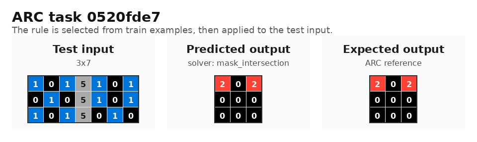
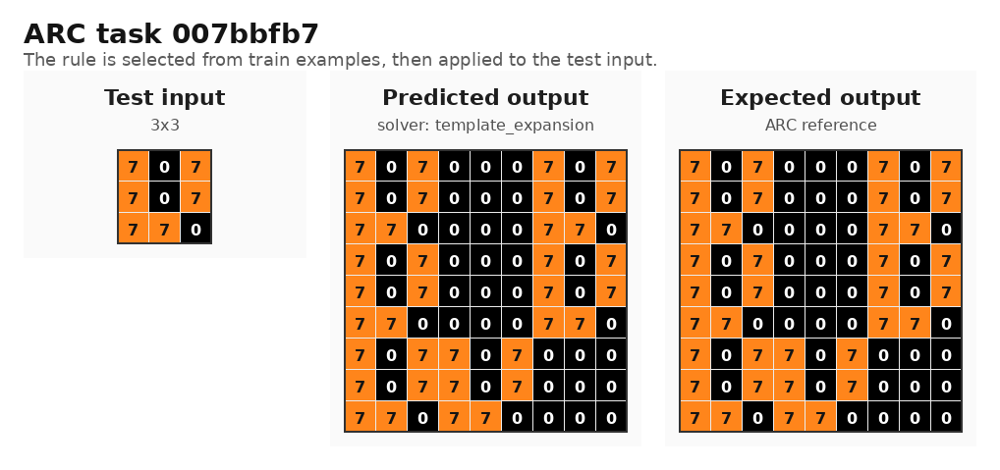
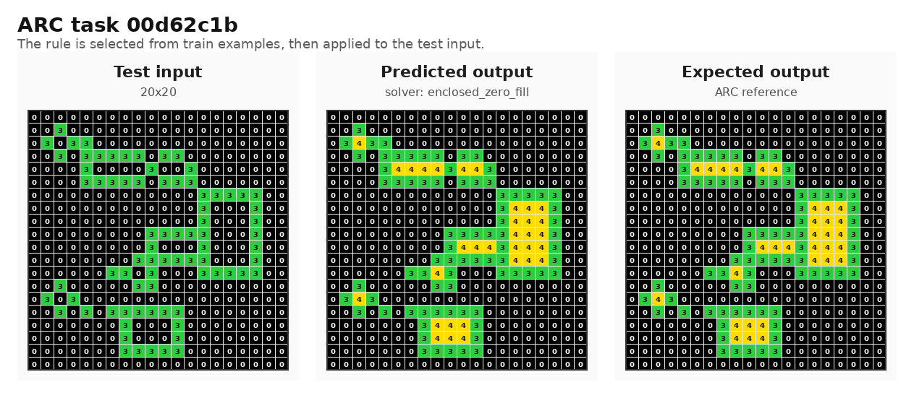

# Практична робота: концептуальна модель для ARC-AGI

## 1. Ідея роботи

У цій роботі я перевіряю простий підхід до задач ARC-AGI: не навчати велику модель, а підібрати правило, яке пояснює всі навчальні приклади конкретної задачі. Якщо правило збігається з усіма парами `input -> output` у train-частині, воно застосовується до test-входу.

Тобто це невелика rule-based система з елементом символічного пошуку: є бібліотека правил, а програма перебирає їх і залишає те, яке підходить до задачі.

Джерело задач: публічний ARC-AGI dataset, файли з `data/training` у репозиторії [fchollet/ARC-AGI](https://github.com/fchollet/ARC-AGI).

## 2. Вибрані задачі

Я взяв три задачі, бо вони показують різні типи перетворень:

| ID задачі | JSON у ARC-AGI | Тип правила | Коротко |
|---|---|---|---|
| `0520fde7` | [0520fde7.json](https://github.com/fchollet/ARC-AGI/blob/master/data/training/0520fde7.json) | логіка над масками | знайти спільні одиниці у двох масках |
| `007bbfb7` | [007bbfb7.json](https://github.com/fchollet/ARC-AGI/blob/master/data/training/007bbfb7.json) | повторення шаблону | розкласти вхідну сітку по великих блоках |
| `00d62c1b` | [00d62c1b.json](https://github.com/fchollet/ARC-AGI/blob/master/data/training/00d62c1b.json) | просторове міркування | зафарбувати нулі всередині замкнутих контурів |

Локальні копії лежать у `data/selected_tasks/`.

## 3. Інтерпретація закономірностей

### Задача `0520fde7`

У вхідній сітці розміру `3x7` є вертикальний стовпчик кольору `5`. Він ділить сітку на дві частини `3x3`. Ці частини можна читати як дві бінарні маски.

Помічена закономірність:

1. Беремо ліву і праву маски.
2. Порівнюємо їх у кожній позиції.
3. Якщо зліва і справа одночасно стоїть `1`, у відповідній клітинці відповіді ставимо `2`.
4. В інших позиціях ставимо `0`.

Фактично це операція `AND` над двома масками, тільки результат позначається кольором `2`.

### Задача `007bbfb7`

Тут вхід має розмір `3x3`, а вихід - `9x9`. Вихідна сітка складається з дев'яти блоків `3x3`.

Помічена закономірність:

1. Кожна клітинка вхідної сітки відповідає одному блоку у вихідній сітці.
2. Якщо клітинка вхідної сітки дорівнює `0`, відповідний блок залишається порожнім.
3. Якщо клітинка ненульова, у цей блок копіюється вся початкова сітка.

Тобто вхід використовується двічі: як карта розміщення блоків і як сам шаблон, який треба вставляти.

### Задача `00d62c1b`

Вхід містить фон `0` і лінії кольору `3`. У виході частина нульових клітинок замінюється на `4`.

Помічена закономірність:

1. Нулі, до яких можна дійти від краю сітки, вважаються зовнішнім фоном.
2. Нулі, які відрізані від краю лініями кольору `3`, є внутрішніми областями.
3. Такі внутрішні області треба зафарбувати кольором `4`.
4. Клітинки кольору `3` не змінюються.

Це зручно реалізувати через flood fill: спочатку знайти весь зовнішній фон, а потім зафарбувати нулі, які не були знайдені.

## 4. Реалізований підхід

У проекті є три правила, по одному для кожного типу задачі. Кожне правило має вигляд:

```python
Grid -> Grid | None
```

Якщо правило не підходить до форми вхідної сітки, воно повертає `None`. Якщо підходить, повертає побудовану відповідь.

Основні файли:

| Файл | Що в ньому |
|---|---|
| `main.py` | запуск експерименту і друк результатів |
| `arc_utils.py` | завантаження JSON, робота з сітками, порівняння відповідей |
| `solvers.py` | три реалізовані правила |
| `data/selected_tasks/*.json` | вибрані задачі |
| `assets/arc_results/*.png` | візуальні результати для звіту |

Вибір правила зроблено просто:

```python
for solver in SOLVERS:
    if all(solver(input) == output for input, output in train_examples):
        selected_solver = solver
        break
```

У коді це рознесено трохи акуратніше: є `solver_matches_task(...)` і `select_solver(...)`, але логіка саме така.

### Реалізовані правила

`mask_intersection`

- шукає центральний вертикальний розділювач кольору `5`;
- ділить сітку на дві однакові частини;
- ставить `2` там, де в обох частинах стоїть `1`.

`template_expansion`

- створює сітку більшого розміру;
- проходить по клітинках вхідної сітки;
- для кожної ненульової клітинки копіює весь вхідний шаблон у відповідний блок.

`enclosed_zero_fill`

- запускає flood fill від меж сітки по нульових клітинках;
- позначає нулі, які належать зовнішньому фону;
- решту нулів зафарбовує кольором `4`.

## 5. Тестування

Запуск:

```bash
python3 main.py
```

У кожній з трьох вибраних задач в ARC-файлі є один test-вхід з еталонним `output`. Разом це дає три тестові приклади для перевірки концепції.

Результат запуску:

```text
Task: 007bbfb7
Selected solver: template_expansion
Train examples matched: 5/5
Match: YES

Task: 00d62c1b
Selected solver: enclosed_zero_fill
Train examples matched: 5/5
Match: YES

Task: 0520fde7
Selected solver: mask_intersection
Train examples matched: 3/3
Match: YES

Summary: 3/3 tasks passed all available tests.
```

### `0520fde7`

Обране правило: `mask_intersection`.

Тестовий вхід:

```text
1 0 1 5 1 0 1
0 1 0 5 1 0 1
1 0 1 5 0 1 0
```

Прогноз:

```text
2 0 2
0 0 0
0 0 0
```

Прогноз повністю збігся з еталоном.



### `007bbfb7`

Обране правило: `template_expansion`.

Тестовий вхід:

```text
7 0 7
7 0 7
7 7 0
```

Вихід має розмір `9x9`: блоки, що відповідають клітинкам `7`, заповнені копією вхідного шаблону, а блоки для `0` залишені порожніми.

Прогноз повністю збігся з еталоном.



### `00d62c1b`

Обране правило: `enclosed_zero_fill`.

На тесті програма знайшла кілька замкнутих областей усередині контурів кольору `3` і зафарбувала їх кольором `4`. Зовнішній фон залишився `0`.

Прогноз повністю збігся з еталоном.



## 6. Де підхід працює, а де ні

Підхід добре працює в цих трьох задачах, бо для них вийшло описати коротке і перевірюване правило. Тут не треба вгадувати відповідь статистично: достатньо знайти правильну операцію над сіткою.

Сильні сторони:

- рішення легко пояснити словами;
- можна перевірити, чому саме правило було вибране;
- для таких задач не потрібні великі навчальні дані;
- правило, знайдене на train-прикладах, застосовується до нового test-входу.

Обмеження:

- бібліотека правил дуже мала;
- правила частково прив'язані до конкретних кольорів, наприклад `5` як розділювач або `4` як колір заливки;
- немає автоматичного створення нових правил;
- немає пошуку композицій, наприклад `знайти об'єкт -> обрізати -> повернути -> перефарбувати`;
- якщо дві гіпотези однаково добре проходять train, програма поки що не має нормального критерію, яку з них вважати простішою або надійнішою.

Через це система не є універсальним розв'язувачем ARC. Вона скоріше демонструє мінімальну робочу ідею: частину задач можна вирішувати як пошук короткої програми над сіткою.

## 7. Перспективи масштабування

Щоб масштабувати підхід, я б розвивав його як DSL/program search:

1. Додати більше базових операцій: пошук компонент, bounding box, повороти, симетрії, обрізання, підрахунок кольорів, заміна кольорів.
2. Дозволити композиції кількох операцій.
3. Перебирати короткі програми і відкидати ті, які не проходять усі train-приклади.
4. Додати оцінку простоти правила, щоб не брати надто складну гіпотезу, яка випадково підійшла до train.
5. За потреби додати ML-модель не як готового розв'язувача, а як підказку для пошуку: які операції пробувати першими.

У такому вигляді підхід може бути корисною частиною більш загальної системи. Сам по собі він не є AGI, але він добре показує важливу для ARC ідею: треба працювати не тільки з пікселями, а й з об'єктами, областями, масками та просторовими відношеннями.
